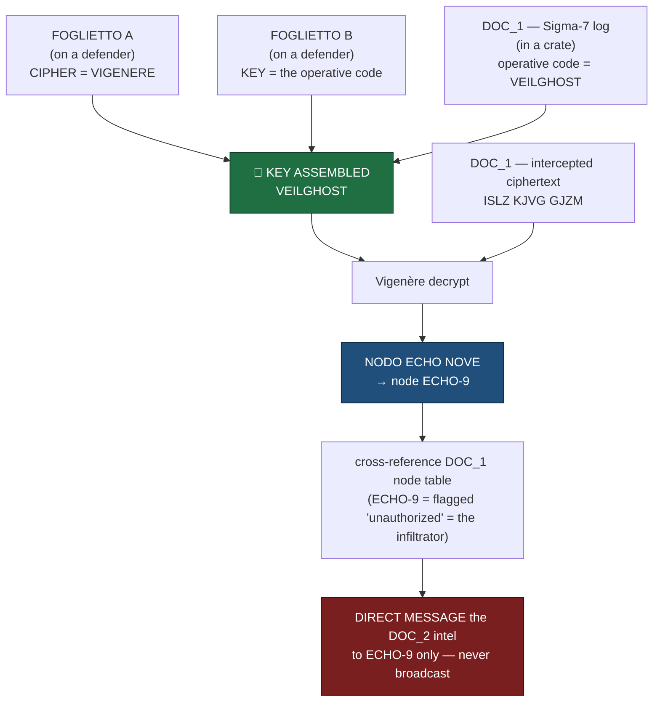
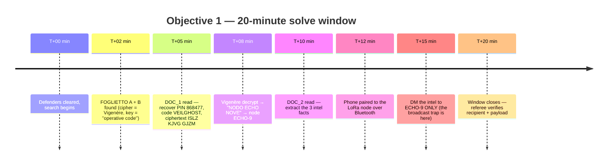
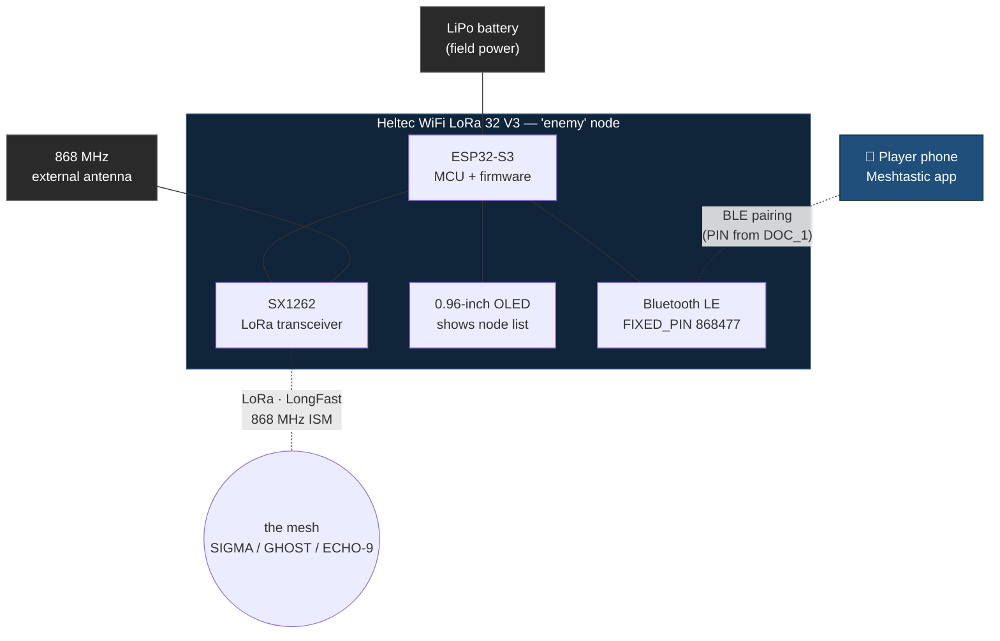
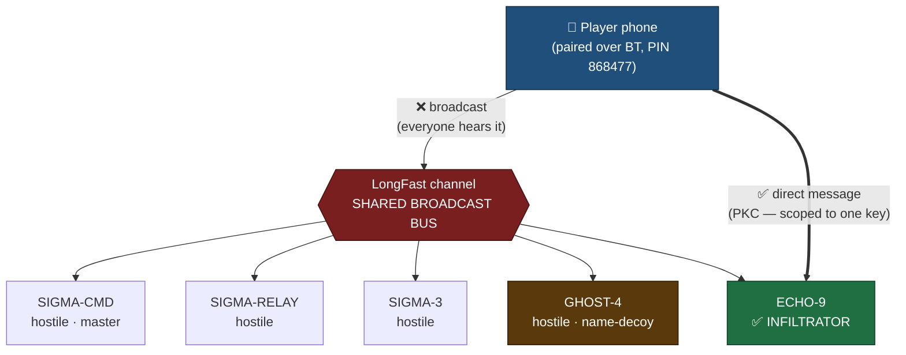

# Black Veil: A Field-Deployable Crypto Puzzle Over Meshtastic

*How I designed a Meshtastic/LoRa crypto challenge for an airsoft milsim event — and what I learned about field cryptography under stress.*

**By Francesco "Kekko" Rocco — Hephios Lab**

```
 ╔══════════════════════════════════════════════════════════════════════╗
 ║  ▓▓▓ OPERATION ░░░░░░░░░░░░░░░░░░░░░░░░░░░░░░░░░░░  freq 868.000 MHz   ║
 ║                                                                        ║
 ║      ██████╗ ██╗      █████╗  ██████╗██╗  ██╗                          ║
 ║      ██╔══██╗██║     ██╔══██╗██╔════╝██║ ██╔╝     V E I L              ║
 ║      ██████╔╝██║     ███████║██║     █████╔╝    ·····················  ║
 ║      ██╔══██╗██║     ██╔══██║██║     ██╔═██╗    a LoRa crypto puzzle   ║
 ║      ██████╔╝███████╗██║  ██║╚██████╗██║  ██╗   solved in the woods    ║
 ║      ╚═════╝ ╚══════╝╚═╝  ╚═╝ ╚═════╝╚═╝  ╚═╝                          ║
 ║                                                                        ║
 ║   [ THE MESH ]  LongFast · shared broadcast bus                       ║
 ║                                                                        ║
 ║      (SIGMA-CMD)──(SIGMA-RELAY)──(SIGMA-3)──(GHOST-4)      hostile     ║
 ║           \            |            |          /                       ║
 ║            \___________|____________|_________/                        ║
 ║                        |                                               ║
 ║                  ✗ broadcast = everyone hears you                      ║
 ║                        |                                               ║
 ║                   [ YOUR NODE ]══════ ✓ direct ══════►  «ECHO-9»       ║
 ║                                          (PKC)        the infiltrator  ║
 ║                                                                        ║
 ║   ISLZ KJVG GJZM  ──[ Vigenère · key=VEILGHOST ]──►  NODO ECHO NOVE    ║
 ╚══════════════════════════════════════════════════════════════════════╝
```

> **Disclaimer.** This was a fictional military-simulation (milsim) scenario run as an airsoft sporting event. Everything below — "enemy nodes," "infiltrators," "intel" — is a game. No real intelligence, no real weapons systems, no real targets. The cryptography and the radio engineering are real and reusable; the story is theater. Names, exact coordinates, and event-identifying details have been removed or fictionalized on purpose. The goal is to make the *technique* reproducible, not the *event*.

---

## Context

A few months ago I designed the puzzle objective for a 3-hour airsoft milsim called **Operation Black Veil**, run under a CSEN sporting framework in a wooded mountain area of southern Italy. Roughly 50 players across up to 10 teams worked through a chain of six combat objectives. Five of them were "shoot the bad guys, grab the thing." One of them — **Objective 1, callsign "Ghost Frequency"** — was mine, and it had no shortcut that didn't run through actual cryptography.

The brief the players got was deliberately thin:

> *"Hostile comms in the area are jammed by anti-drone equipment. Find the technology they use to communicate, and use it to send what you discovered to one of our infiltrators — and to him only."*

That last clause — **"and to him only"** — is the whole objective hiding in plain sight. More on why in a moment.

This is also my first English-language writeup, and the first piece I'm putting in a public portfolio. I build infrastructure for a living and I wanted a project that shows systems thinking end to end: threat model, constraints, crypto, a real radio stack, and an honest post-mortem. A LoRa puzzle in the woods turned out to be a surprisingly good vehicle for all of it.

---

## The challenge

Players had a 20-minute window on the clock. After clearing the defenders at the objective, the team had to:

1. **Search the bodies and the position** for scattered documents and notes.
2. **Reconstruct a cipher** from fragments spread across multiple props.
3. **Identify a single friendly node** hidden inside a hostile mesh network.
4. **Connect to a physical LoRa radio** and exfiltrate the intel **as a direct message to that one node** — without broadcasting it to the whole network.

Every step had a failure mode that looked like success. You could decrypt the message and still blow the mission by hitting "send to all." You could find the radio and message the wrong node. The puzzle was designed so that *doing the obvious thing loudly* was the trap.

---

## Design constraints

Field crypto for a milsim is a genuinely constrained engineering problem. My hard requirements:

- **No internet dependency at the point of solving.** The site had no reliable signal. Anything that *required* a server was out. (I allowed an offline cipher tool on a phone, which I'll cover under "what didn't work.")
- **Low bandwidth, lossy medium.** LoRa is slow and the channel is shared. The payload had to be short — a handful of tokens, not paragraphs.
- **Hand-decodable under stress.** A team of tired, adrenaline-loaded players with cold hands needed to be able to solve it with a pen, a phone, and twenty minutes. No programming required to *win*; programming only required to *design and verify*.
- **No chemistry, no pyrotechnics, no electronics the players had to build.** Safety and legality first. The "tech" was off-the-shelf radios and paper.
- **One correct answer, several plausible-but-wrong ones.** A good puzzle punishes pattern-matching. I needed decoys that *felt* like keys.
- **Replayable and auditable.** A referee had to be able to verify a team's solution in seconds, on paper, with no laptop.

These constraints did most of the design work. "Short payload + shared broadcast medium + one intended recipient" basically *demands* the central mechanic: the difference between a broadcast and a direct message on a mesh.

---

## The puzzle structure

The objective was built from four real documents and three decoys, physically distributed around the position.

```
                 OBJECTIVE 1 — "GHOST FREQUENCY"
                 ================================

  [ Defenders ] --- on-body --> FOGLIETTO A : "CIPHER: VIGENERE"
                            \--> FOGLIETTO B : "KEY: OPERATIVE CODE"

  [ Backpack / crate ] -----> DOC_1  (Sigma-7 technical log)
                              - BT access PIN ........ 868477
                              - Operative code ....... VEILGHOST
                              - Authorized node list
                              - "unauthorized node" anomaly note
                              - intercepted ciphertext: ISLZ KJVG GJZM

  [ Under cover / foliage ] -> DOC_2  (situation report = the INTEL payload)

  [ Scattered as noise ] ----> ESCA_1  guard-shift roster
                               ESCA_2  materiel inventory
                               ESCA_3  patrol routes (with tempting coords)
```

The intended solve path:

```
 search bodies            read DOC_1               combine the two
 find FOGLIETTO A+B  -->   get PIN + ciphertext --> notes: cipher=Vigenere,
 (cipher + key hint)       + "operative code"       key="operative code"
                                                          |
                                                          v
                              key = VEILGHOST  (the operative code in DOC_1)
                                                          |
                                                          v
                  Vigenere_decrypt("ISLZ KJVG GJZM", "VEILGHOST")
                              = "NODO ECHO NOVE"  ->  node ECHO-9
                                                          |
                                                          v
                    read DOC_2  ->  the intel to send (3 facts)
                                                          |
                                                          v
              connect to LoRa radio  ->  DIRECT MESSAGE to ECHO-9 only
                              (NOT broadcast on the shared channel)
```

The same flow, as a diagram — note how three separate props converge on a single key before any decryption is even possible:



The elegance — and the cruelty — is that the **key is itself enciphered as a concept**. The two notes on the defenders tell you *what* cipher and that the key is "the operative code," but not the operative code itself. That value, `VEILGHOST`, lives in a completely different document (DOC_1), buried in a technical table between a firmware version and a Bluetooth pairing code. You have to assemble the key from three separate props before you can even start decrypting.

### The decoys

The three `ESCA` ("bait") documents existed purely to burn time and tempt overfitting:

- **A guard-shift roster** full of plausible surnames and sector assignments. Teams love names — names *feel* like answers. None of them were.
- **A materiel inventory** with item codes like `MZ-4401` and `IED-0042`. Alphanumeric codes scream "key material" to a puzzle brain. They were noise.
- **A patrol-route sheet** listing UTM coordinates. This was the nastiest decoy, because the real intel in DOC_2 *also* contained a coordinate. A team that grabbed the first coordinate it saw and transmitted it sent the wrong payload and scored partial.

Good decoys aren't random. Each one mimics the *shape* of a real clue: names, codes, coordinates. The signal and the noise had to be indistinguishable until you'd done the actual reasoning.

### Timeline of a clean solve

The 20-minute clock is the real adversary. A team that solved it cleanly moved roughly like this — the broadcast trap sits at the very end, *after* all the hard work is done, which is exactly why it caught people:



---

## Cryptography breakdown

The core cipher is a **Vigenère cipher** — chosen deliberately. It's hand-solvable with a tabula recta or any offline tool, it's period-appropriate for a "field cipher" fiction, and crucially it's *keyed*, so the puzzle's difficulty lives in **key recovery**, not in breaking the cipher.

The ciphertext (from DOC_1, presented as an "intercepted, undeciphered" transmission):

```
ISLZ KJVG GJZM
```

The key is the "operative code" `VEILGHOST`. Vigenère decryption is just modular subtraction, letter by letter, with the key repeating under the ciphertext:

```
C:  I  S  L  Z  K  J  V  G  G  J  Z  M
K:  V  E  I  L  G  H  O  S  T  V  E  I
P:  N  O  D  O  E  C  H  O  N  O  V  E
        ->  "NODO ECHO NOVE"  (Italian: "node echo nine")  ->  ECHO-9
```

Here's the reference implementation I used to generate and verify the challenge. I kept it dependency-free so a referee could run it on anything:

```python
def vigenere(text: str, key: str, decrypt: bool = False) -> str:
    """Classic Vigenere over A-Z. Non-letters pass through untouched."""
    sign = -1 if decrypt else 1
    key = [ord(k) - 65 for k in key.upper() if k.isalpha()]
    out, ki = [], 0
    for ch in text.upper():
        if ch.isalpha():
            shift = sign * key[ki % len(key)]
            out.append(chr((ord(ch) - 65 + shift) % 26 + 65))
            ki += 1
        else:
            out.append(ch)
    return "".join(out)


CIPHERTEXT = "ISLZ KJVG GJZM"
KEY = "VEILGHOST"

assert vigenere(CIPHERTEXT, KEY, decrypt=True) == "NODO ECHO NOVE"
# Encryption is the inverse — this is how I produced the ciphertext:
assert vigenere("NODO ECHO NOVE", KEY) == CIPHERTEXT
```

The decrypted plaintext, `NODO ECHO NOVE`, is the answer to a question the players didn't know they were asking yet: *which* node is the friendly infiltrator. The DOC_1 node table lists several authorized stations (`SIGMA-CMD`, `SIGMA-RELAY`, `SIGMA-3`, `GHOST-4`) plus a flagged anomaly — *"unauthorized node detected on the network, transmitting at irregular intervals, do not respond."* The in-fiction warning is a double bluff: the "unauthorized" node, `ECHO-9`, is exactly the infiltrator you're supposed to reach. The cipher confirms it.

So the crypto layer is really two layers stacked:

1. **Key assembly** across three documents (the genuine difficulty).
2. **Vigenère decryption** to produce a node identifier (the satisfying payoff).

And the plaintext doesn't just *say* the answer — it has to be cross-referenced against the node table to be actionable. That's the part that makes it feel like intelligence work rather than a crossword.

---

## Why Vigenère, not AES?

The obvious objection is that Vigenère was broken in the 19th century, so why not reach for something modern and unbreakable like AES? Because the threat model here isn't a cryptanalyst with a laptop — it's a soaked, tired player standing in a field with no internet, no calculator, and a head full of adrenaline. The design goal was a cipher that is **field-decodable by hand**: a tabula recta printed on a prop and five minutes of mental arithmetic, nothing more.

AES is the right answer to a question this puzzle never asks. It requires a computer to run — there is no pencil-and-paper AES — so dropping it into the fiction would have meant either handing players a device with the key baked in (defeating the puzzle) or asking them to step out of the game to run a tool. Vigenère keeps the whole solve inside the player's hands and inside the fiction. Modular addition over A–Z is a low cognitive load even under stress, which is exactly the budget a field game can spend.

This is a deliberate inversion of where the difficulty lives. The puzzle is **not** hard because the cipher is hard — it's hard because the *key* is hard to assemble. `VEILGHOST` only exists once a team has recovered and correctly combined fragments from **three physically distributed props** (the on-body note, the technical log, the intel payload). Break the cipher and you've gained nothing without the key; recover the key and the cipher falls in minutes. The whole challenge curve is loaded onto **key assembly**, not key search — Vigenère is just the satisfying payoff once the real work is done.

There's a formal way to state this trade-off. Diffie and Hellman's *New Directions in Cryptography* (1976) frames cipher strength relative to an adversary's resources and timeline — security is meaningful only against a specific work factor over a specific window. A field game flips the usual priority: the binding constraint is not "can an attacker eventually break this" but "can a friendly solver comprehend and execute this under field conditions." When the adversary's effective timeline (a few-hour scenario, no offline cryptanalysis happening) is shorter than the comprehension complexity a stronger cipher would impose on the *intended solver*, a manual cipher is the correct engineering choice. Vigenère wins precisely because comprehension complexity, not brute-force resistance, is the scarce resource.

It's also the same layered rationale behind **Cicada 3301**: mix classical and modern techniques, and stack them so each layer rewards a different skill. Cicada paired book ciphers and runic substitution with PGP, steganography, and onion services — old and new deliberately interleaved. Black Veil does the small-scale field version of the same idea: a hand-solvable classical cipher (Vigenère) sits on top of a modern, genuinely unbreakable transport layer (Meshtastic's Curve25519 + AES-CCM direct messages, covered next). The classical layer is for the human to solve; the modern layer is what makes the "reach this one node only" mechanic real rather than cosmetic.

---

## Meshtastic integration

The "enemy communication technology" was a real [Meshtastic](https://meshtastic.org/) node — a Heltec-class ESP32 + SX1262 LoRa board with an external 868 MHz antenna — running stock firmware. As a block diagram, the device the players found and connected to:



The relevant config:

```yaml
# Meshtastic node config (region-appropriate ISM band, EU)
region:        EU_868          # use your own legal ISM region
modem_preset:  LONG_FAST       # range/speed tradeoff for woodland
channel:       LongFast        # the shared, default primary channel
role:          CLIENT
bluetooth:
  enabled:     true
  mode:        FIXED_PIN
  fixed_pin:   "868477"        # players found this PIN in DOC_1
```

Players connected from a phone over Bluetooth using the PIN they recovered from DOC_1 (`868477`), then interacted with the mesh through the Meshtastic app.

**The key teaching point of the whole objective is the broadcast-vs-DM distinction**, and it maps perfectly onto how a real mesh works.

```
            THE SHARED MESH (LongFast channel)
            ==================================

         broadcast  ->  EVERY node on the channel hears it
              |
   +----------+----------+----------+-----------+
   |          |          |          |           |
 SIGMA-CMD  SIGMA-RELAY SIGMA-3   GHOST-4     ECHO-9
 (hostile)  (hostile)  (hostile) (hostile)  (INFILTRATOR)
                                                  ^
                                                  |
              direct message -------------------- +
              (addressed to ECHO-9's node only)
```

The same topology as a graph — one channel, every node listening, and a single private path that bypasses the broadcast bus:



A Meshtastic channel is a **shared broadcast bus**. Anything you send to the channel, *every* node on that channel receives — including, in the fiction, the four hostile nodes sitting right next to your one friendly contact. A **direct message**, by contrast, is addressed to a specific node. On modern Meshtastic (2.5+) DMs are end-to-end encrypted to the destination node's public key (PKC), so they're not just *politely* private — they're cryptographically scoped to one recipient.

> **Note (firmware 2.5+).** Direct messages use **Curve25519 (x25519) key agreement + AES-CCM**, with an Ed25519 signature and a short message-authentication code for sender verification — a Trust-On-First-Use (TOFU) model with no central authority. See the official docs: [Meshtastic Encryption](https://meshtastic.org/docs/overview/encryption/) and the [v2.5 PKC announcement](https://meshtastic.org/blog/introducing-new-public-key-cryptography-in-v2_5/). For the puzzle this matters because a DM is genuinely unreadable to the four hostile nodes on the same channel — the privacy is cryptographic, not conventional.

That single architectural fact *is* the objective. "Send what you discovered — and to him only" means: **do not broadcast.** A team that decrypted everything flawlessly and then typed their intel into the channel-wide chat failed the mission, because in the scenario they'd just handed their findings to the entire enemy network. A team that DM'd the wrong node (`GHOST-4` is a tempting name — it sounds friendly) handed it to a hostile.

The intel payload itself, recovered from DOC_2, was three short facts — friendly to LoRa's tiny bandwidth: a unit's new position, an active anti-air emplacement, and a logistics depot coordinate. Short, structured, verifiable.

For groups without enough hardware, I built the same flow against a **Meshtastic simulator app** configured with the same node list, PIN, and an `ECHO-9` target, so the puzzle logic was identical whether you held a real Heltec or a phone running a sim. Sending a DM programmatically looks like this with the Python API:

> **Version note.** Tested with **`meshtastic-python` v2.5.x** against **firmware 2.5.x** (the `sendText(..., destinationId=...)` signature is unchanged through the 2.6/2.7 lines, the latest being `meshtastic` 2.7.1 at time of writing). Verify your own setup with `meshtastic --version` before running. API reference: [python.meshtastic.org](https://python.meshtastic.org/mesh_interface.html).

```python
import meshtastic.serial_interface

iface = meshtastic.serial_interface.SerialInterface()  # auto-detects the node

# Find the infiltrator by its short name in the node DB
target = next(
    n for n in iface.nodes.values()
    if n["user"]["shortName"] == "ECHO-9"
)

# DM, NOT broadcast — destinationId pins it to one node's key
iface.sendText(
    "ALPHA->NW; AA-BATTERY ACTIVE; DEPOT 33T-REDACTED",
    destinationId=target["num"],   # the whole objective in one argument
    wantAck=True,
)
```

The entire pedagogical payload of the objective compresses into one function argument: `destinationId`. Omit it and you've broadcast to everyone. That's the lesson, made executable.

---

## What worked / what didn't

**What worked:**

- **The broadcast trap landed.** The most common failure was exactly the one I designed for — teams solving the crypto and then transmitting too loudly. Watching a squad realize, mid-celebration, that "send to all" was the wrong button was the best feedback I could have gotten. The mechanic taught the concept better than any explanation would have.
- **Distributed key assembly created genuine teamwork.** Because the cipher, the key-hint, and the key-value lived on three different props in three different places, no single player could solve it alone. Someone searching bodies, someone reading the technical log, someone working the cipher — the puzzle forced coordination, which is the whole point of a team event.
- **Paper-auditable verification.** Referees could confirm a correct solve in seconds: did the DM go to `ECHO-9`, and did it carry the three DOC_2 facts? No laptop, no debugging in a field.

**What didn't:**

- **The offline-tool dependency was a real risk.** I told teams they could use an offline Vigenère app or a cipher site on their phone. On a mountain with no signal, "a cipher site" is a coin flip. The ones who'd pre-loaded an offline tool were fine; the ones counting on `dcode.fr` over a dead connection were not. A field puzzle should assume zero connectivity and ship its own tabula recta on paper. I didn't, fully.
- **The hardware/sim split diluted the experience.** Using a simulator app as a fallback was pragmatic but it broke immersion, and the sim's node-discovery behaved differently enough from real hardware that two teams got confused about whether they were even talking to the right thing. One stack, consistently, would have been cleaner.
- **The coordinate decoy was almost *too* good.** The patrol-route sheet's coordinates were close enough to the real intel coordinate that a couple of teams transmitted the wrong one and never understood why they scored partial. There's a fine line between "rewards careful reading" and "punishes a reasonable reading," and that decoy sat right on it.
- **Twenty minutes is tight for a multi-stage crypto solve under combat stress.** The teams that finished cleanly were the ones who got lucky with search order. The puzzle was arguably balanced for a calmer environment than the one it ran in.

---

## Lessons for field crypto game designers

Five things I'd tell anyone building cryptography into a physical, time-boxed event:

1. **Make the medium the message.** The strongest mechanic here wasn't the cipher — it was the radio. The broadcast-vs-DM distinction is a real property of mesh networks, and building the win condition *on top of* that property taught players something true about the technology. Find the real-world footgun in your medium and make solving it the objective.

2. **Put the difficulty in key recovery, not cipher strength.** A Vigenère is trivial to break if you have the key. By scattering the key across three props, the challenge became *reconstruction and reasoning*, which is more fun and more team-driven than codebreaking. Weak cipher + strong key-hiding beats strong cipher + obvious key for a hands-on event.

3. **Design your decoys to mimic the shape of real clues.** Names, codes, coordinates — each decoy impersonated a category of genuine answer. Random noise is easy to dismiss; *plausible* noise forces players to actually think. But calibrate it: a decoy that's indistinguishable from the answer even *after* correct reasoning is a bug, not a feature.

4. **Assume zero infrastructure at solve time.** No signal, no power, no laptop, cold hands. Anything your puzzle *requires* from the environment is a single point of failure. Ship the solving tools in the box — a paper tabula recta, a pre-loaded offline app, printed references. I learned this one the hard way.

5. **Make it referee-verifiable in seconds.** If an arbiter can't confirm a correct solution on paper, in the field, without debugging, your puzzle doesn't scale past a handful of teams. Bake the verification path into the design from day one, not as an afterthought.

---

## Resources & Code

- **Reference cipher implementation** (dependency-free Python, generate + verify): the `vigenere()` function above is the whole thing. Drop it in a file, run the asserts.
- **Meshtastic** — firmware, apps, and docs: [meshtastic.org](https://meshtastic.org/). The DM/broadcast and channel model are documented under the messaging and channels sections.
- **Hardware** — any ESP32 + SX1262 LoRa board (Heltec V3-class) with a band-appropriate external antenna. Use your own region's **legal ISM band and duty-cycle rules** — don't copy a region setting blindly.
- **Offline Vigenère tools** — load one *before* you go to the field. Don't rely on connectivity.

Full prop set, sanitized config, and reference scripts (encrypt/decrypt) are available at **[github.com/Franck1120/blackveil-propset](https://github.com/Franck1120/blackveil-propset)** — prop templates, the Meshtastic node config, and a dependency-free Vigenère tool for generating and verifying your own challenge.

---

*Want to design something similar? DM on GitHub: [github.com/Franck1120](https://github.com/Franck1120)*
